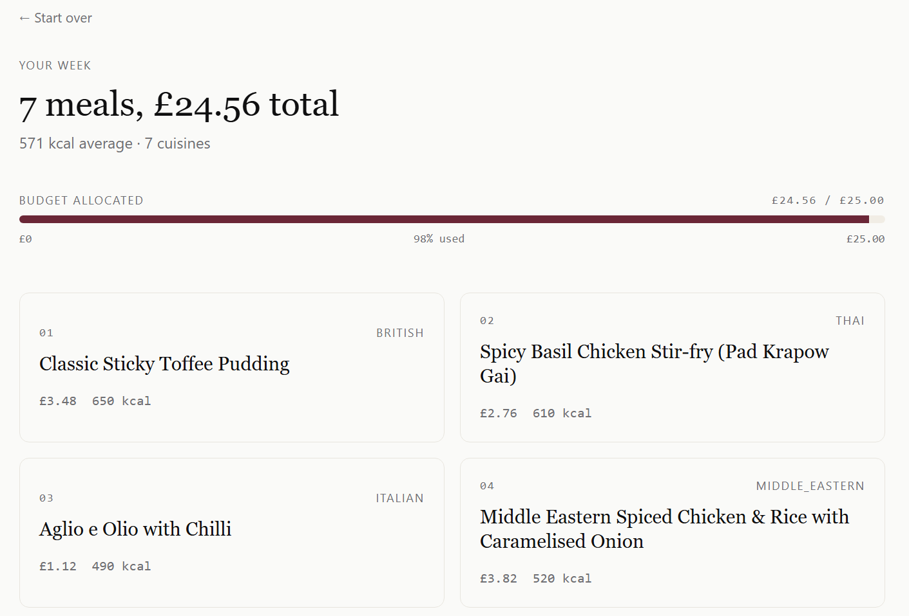
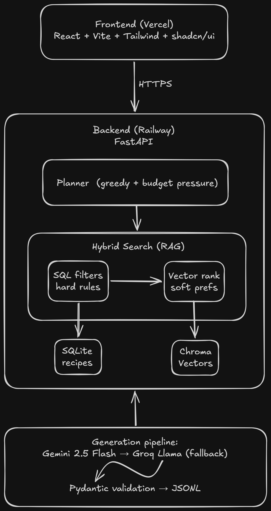

# Pantry

**A budget-aware weekly meal planner that combines RAG, constraint-satisfaction, and a curated recipe dataset to turn a budget into a real week of food.**

🔗 **Live demo:** [meal-planner-livid-eight.vercel.app](https://meal-planner-livid-eight.vercel.app/)

> Heads up — the backend runs on a free tier and sleeps when idle. The first request after inactivity can take 15–25 seconds to wake up; subsequent ones are fast.



---

## Why this exists

Most "AI meal planner" projects are wrappers around a language model: ask the model for 7 meals, hope they fit your budget, accept whatever you get. They have two problems — LLMs are bad at arithmetic (so meal plans miss budgets by significant margins), and there's no real engineering substance to show.

Pantry is built differently. The interesting problem isn't *generating* recipes — frontier models do that fine. The interesting problem is *selecting* 7 recipes from a curated set that satisfy a hard weekly budget, a soft calorie target, and a stack of dietary and appliance constraints, while still feeling like a varied and appealing week of food. That's a constraint-satisfaction problem with a soft-preference layer on top, and it's solved with code, not with prompts.

## How it works

The system has four layers, each doing what it's best at:



1. **Generation pipeline** — 373 recipes generated in themed batches using Gemini 2.5 Flash with automatic Groq Llama 3.3 70B fallback when rate limits are hit. Every recipe is validated against a Pydantic schema and deduplicated before being stored. The pipeline is checkpointed and resumable.
2. **Storage** — recipes live in SQLite with a normalised schema (recipes ↔ ingredients/steps, with junction tables for tags and appliances). Cost and calorie columns are indexed for fast filtering.
3. **Retrieval (RAG)** — every recipe is embedded with `sentence-transformers/all-MiniLM-L6-v2` (local, free, ~90 MB) and stored in Chroma. Search is *hybrid*: SQL filters the candidate pool down to the legal subset (matching budget, dietary, appliance constraints), then vector search ranks that subset by semantic similarity to the user's preference text. SQL handles the hard rules; embeddings handle the soft signals.
4. **Planning** — a greedy selection algorithm with per-iteration budget-pressure reweighting picks 7 meals from the retrieval-ranked candidates, while tracking cuisine diversity and recomputing the score as the remaining budget tightens. If the greedy plan can't fill 7 slots, it surfaces an honest warning rather than producing nonsense.

The "what runs where" split is deliberate: arithmetic, constraints, and budget tracking are in code (correct every time, milliseconds to run, free to operate); semantic ranking and recipe generation are in the LLM layer (where models genuinely beat hand-written code).

## What's interesting technically

A few things I'd call attention to over the obvious "I used FastAPI" stuff:

**Provider abstraction with automatic fallback.** The generation pipeline uses a single `generate_json(prompt)` function that hides whether the call goes to Gemini or Groq. If Gemini hits its daily rate limit mid-run, the next call falls back to Groq's Llama 3.3 70B transparently. This is real production resilience pattern, not just "I called an API."

**Schema-driven generation with validation.** Recipes aren't just dumped from the LLM — they're parsed into a Pydantic schema with constraints (cuisine must be one of N values, steps must be at least 10 characters, calories must be 0–3000, etc.). Anything that doesn't validate is dropped, not stored. This is how to use LLMs for structured data without ending up with garbage.

**Hybrid SQL + vector search.** The retrieval layer doesn't use embeddings to filter on hard constraints (a common mistake — embeddings can't reliably enforce "vegetarian"). SQL pre-filters the candidate pool first; only then does vector search rank within it. The split between hard rules and soft signals is explicit.

**Per-iteration budget-pressure reweighting in the planner.** Naive greedy selection by fitness fails on tight budgets — the algorithm picks expensive winners early, then can't fill the remaining slots. Pantry's planner recomputes fitness scores *every iteration* based on remaining budget per remaining meal, so cheap dishes become more attractive as budget tightens. This was an iteration on the V1 design after the eval suite caught the failure.

**Automated eval harness with 5 quality properties.** The system isn't just shipped on vibes — there's a `python -m evals.run` command that runs 26 test cases against the planner and reports pass rates per property. Hard constraints pass at 100%; the soft calorie target passes at 88%, with failures concentrated on dataset-bound and candidate-pool-bound edge cases (see Evaluation section below).

## Evaluation

The planner is measured by an automated eval harness over 26 test cases covering budget range, dietary constraints, appliance exclusions, household sizes, and deliberately-hard stress cases (conflicting preferences, heavily-constrained candidate pools, edge calorie targets).

Each plan is checked against 5 quality properties:

| Property | Pass rate | Notes |
|---|---|---|
| Budget adherence | 26/26 (100%) | Hard constraint, enforced in the greedy selection loop |
| Dietary compliance | 26/26 (100%) | Hard constraint, enforced via SQL pre-filter on the candidate pool |
| Appliance compliance | 26/26 (100%) | Hard constraint, enforced via SQL pre-filter on the candidate pool |
| Cuisine diversity | 26/26 (100%) | Soft target (≥3 cuisines), enforced via diversity penalty in scoring |
| Calorie targeting | 23/26 (88%) | Soft target (±20% of requested), bounded by dataset distribution |

Hard constraints pass at 100% because they're enforced in code (SQL filters, greedy budget check), not in LLM heuristics. The three calorie-target failures fall into two categories:

- **Dataset-bound failures**: requesting an average of 1000 kcal/serving when the dataset's recipes max out at 850 kcal — mathematically unachievable regardless of algorithm.
- **Candidate-pool-bound failures**: stacking multiple dietary and appliance constraints shrinks the legal recipe subset to 15-30 candidates. Within these small pools, the planner cannot simultaneously optimize for calorie targeting and the other soft signals; it returns the best available compromise rather than refusing to plan.

Both failure modes are correct behaviour — a planner that hit impossible targets by ignoring constraints would be worse than one that surfaces honest "best available" results. The eval makes these limits visible and measurable rather than hidden.

Run the evals yourself with `python -m evals.run`. Reports are written to `evals/runs/`.

## Known limitations & future work

Documented openly because pretending otherwise reads worse than the limitations themselves.

**Negation in swap queries is not handled correctly.** When a user types "I don't want chicken" into the swap reason, the embedding model treats this as semantically similar to "I want chicken" — both texts are *about* chicken. This is a fundamental limitation of vector search: embeddings capture aboutness, not logic. The fix is to extract logical constraints (excluded ingredients, comparison operators) in code via an LLM structured-extraction step before performing semantic search on the filtered pool. This is a planned V2.

**Recipe prices and calories are LLM-estimated, not measured.** Prices reflect typical UK budget supermarket (Aldi/Lidl level) intuitions and are plausible but not real-time. Calories are model estimates, not lab-measured. For genuine nutritional or financial planning, real data sources would be needed.

**Backend cold starts on the free tier.** First request after inactivity takes ~15-25 seconds while Railway wakes the container. Subsequent requests are fast (sub-second for cached embedding queries).

**Future work — beyond the negation fix:**

- LLM-driven preference chat that updates a session-level preference object across multiple swap turns
- Real grocery price integration (subject to API/ToS availability)
- Confidence-thresholding on low-similarity searches (e.g., "no great matches found — try different keywords")
- Halal and low-carb tag under-representation in the dataset (currently 30 and 4 recipes respectively)

## Tech stack

| Layer | Choice | Why |
|---|---|---|
| Backend | FastAPI (Python) | Auto-generated docs, Pydantic-native validation, async-ready |
| Database | SQLite via SQLAlchemy | One-file, indexed, sufficient at this scale |
| Vector store | Chroma (local persistent) | No infra, file-based, good API at <100k vectors |
| Embeddings | sentence-transformers MiniLM-L6-v2 | Local, free, 384-dim, good for sentence-level search |
| LLM (generation) | Gemini 2.5 Flash + Groq Llama 3.3 70B (fallback) | Free tiers; fallback handles rate limits |
| Frontend | React + Vite + TypeScript + Tailwind | Standard stack, fast iteration |
| Hosting | Vercel (frontend) + Railway (backend) | Free/cheap tiers, GitHub auto-deploy |

## Running locally

You'll need Python 3.12+, Node 20+, and API keys for [Google AI Studio](https://aistudio.google.com) and [Groq](https://console.groq.com) (both have free tiers and no credit card required).

```bash
# Clone
git clone https://github.com/Malzbro/meal-planner.git
cd meal-planner

# Backend
cd backend
python -m venv .venv
.\.venv\Scripts\Activate.ps1     # Windows
# source .venv/bin/activate      # macOS/Linux
pip install -r requirements.txt

# Configure environment
cp ../.env.example ../.env       # then add your GOOGLE_API_KEY and GROQ_API_KEY

# Generate recipes (one-time, ~15 min)
python -m generator.run_all

# Load into SQLite and build the vector index
python -m db.load
python -m rag.index

# Run the API
uvicorn main:app --reload
```

Then in a second terminal:

```bash
cd frontend
npm install
npm run dev
```

Open http://localhost:5173 and you're running.

Run the evaluation harness:

```bash
python -m evals.run
```

## Project layout